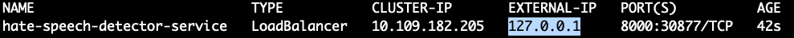
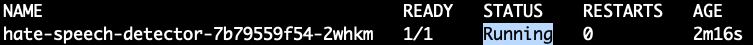

# hate_speech_detection

This project is a text classification model which recognizes if a given text is:
* non-harmful,
* cyberbullying (addressed towards a private person),
* hate speech (addressed towards a public person/entity/large group).

The model is deployed as a FastAPI app inside a Docker container. The repository also contains Kubernetes deployment files.

## Table of Contents
- [Installation](#installation)
- [Running the app](#running-the-app)
  - [Running the app with uvicorn](#running-the-app-with-uvicorn)
  - [Running the app inside a Docker container](#running-the-app-inside-a-docker-container)
  - [Running the app on a local Kubernetes cluster](#running-the-app-on-a-local-kubernetes-cluster)
- [Getting predictions from an endpoint](#getting-predictions-from-an-endpoint)

## Installation

First you need to ensure you have Python installed. The project was developed on the 3.9.6 version.
After you are sure you have Python, follow these steps:
1. Clone the repository
2. Go to the project main directory
3. Create and activate Python virtual environment:
```
python -m venv .venv
# macOS or Linux
source /venv/bin/activate
# Windows PowerShell
./venv/Scripts/activate
```
4. Install dependencies
```
pip install --upgrade pip
pip install -r requirements.txt
```
## Running the app

### Running the app with uvicorn
1. Go to the project main directory
2. Run the following command to run the app:
```
uvicorn app:app --host 0.0.0.0 --port 8000 --reload
```
3. The app is on and running under the following address:
```
http://0.0.0.0:8000/
```
### Running the app inside a Docker container

1. Go to the project main directory
2. Build a Docker image
```
docker build -t <your_image_name> .
```
4. Run the image
```
docker run -p 8000:8000 <your_image_name>
```
5. The app is on and running under the following address:
```
http://0.0.0.0:8000/
```
### Running the app on a local Kubernetes cluster
1. To run the app on Kubernetes locally, you will need minikube. [Here](https://minikube.sigs.k8s.io/docs/start/) you can find personalized installation instructions based on which OS you have.
2. Go to the project main directory
3. When you have minikube installed, start a local cluster by running this command:
```
minikube start
```
4. Create a Kubernetes deployment, service and (optionally) HPA policy by running the following commands:
```
kubectl apply -f kubernetes/deployment.yaml
kubectl apply -f kubernetes/service.yaml
kubectl apply -f kubernetes/hpa.yaml # optional
```
5. Start tunneling so that our local Kubernetes service will get an external IP
```
minikube tunnel
```
6. Open a new Terminal tab/window and run the following command to see if your service has an external IP
```
kubectl get services
```
If the external IP has been created, you should see the similar output: 



In this case, the service IP will be
```
http://127.0.0.1:8000/
```
7. Just to make sure the service is already working, you can check the pods
```
kubectl get pods
```
If the pod status is "Running", the service should be ready to use.



IMPORTANT NOTE: This deployment strategy pulls the Docker image from Docker Hub instead of depending on the one built locally. If you want to use your own image, I suggest pushing your image to Docker Hub (or any other container registry) and changing the "image" field in the [Kubernetes deployment configuration](kubernetes/deployment.yaml).

## Getting predictions from an endpoint

The model is placed on the __/detect-hate-speech/__ endpoint. The request body the endpoint accepts is:
```
{
  "text": "string"
}
```
The text has to be in Polish, otherwise the model output will be irrelevant.

There are several ways to invoke the endpoint. The instruction shows how to do it using the Python requests library:
```python
import requests
host = "http://127.0.0.1:8000/detect-hate-speech/"
request_body = {
    "text": "Dzisiaj gramy bardzo ważny mecz! Do boju Polsko!"
}
response = requests.post(url=host, json=request_body)
print(response.text)
# OUTPUT: {"predicted_class":"non-harmful"}
```
Of course the host IP address will look differently depending on which deployment type you chose. The example bases on local Kubernetes cluster.

The other simple way to test the endpoint is go to http://127.0.0.1:8000/docs (IP depending on running way) and test the endpoint from there.
